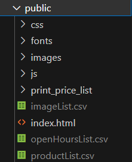

# Local setup

## Google sheet download

### Installs

* Install gspread 

    ``` 
    python -m pip install gspread 
    ```

* Install oauth2client

    ```
    python -m pip install oauth2client
    ```

### Get data from google sheet

* In the terminal from the projects root folder input the following: 

    ```
    python googleSheetDownloader.py
    ```

* Check public folder for csv-files (see the image below)



## Finalise local setup

* In the terminal from the projects root folder input the following: 

    ```
    python .\RaspberryPi\configuration\startServer.py
    ```

* To view the project go to the local host at [127.0.0.1:8000](http://127.0.0.1:8000/)
