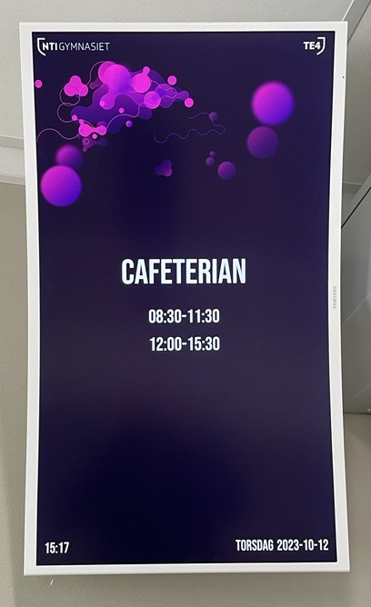

# Cafeteria display

## Introduction

This project is a raspberry pi driven "Cafeteria display" which runs a website with the café´s opening hours, items and menu.

[Link to Google Drive](https://drive.google.com/drive/folders/1Yf2ABcoPqGIK5E88mXdyQchkGVjTMYVt)

The Raspberry Pi gets the menu and items from a Google Spreadsheets sheet where you can configure the products and prices shown on the screen. Image slides and opening hours can also be changed in the spreadsheet. Changes in the spreadsheet takes up to 10 minutes before showing on the screen. 

[Link to spreadsheet](https://docs.google.com/spreadsheets/d/1wN90DoWtkIRofBl3Jm_UkQMeDUDMMIszM-5tlwlPICA/)

## Environments and Languages 
[Documentation](documentation/environmentsLanguages.md)

## Local development environment

[Instructions](documentation/localSetup.md)

## Tests

There are automated tests made with Selenium that use test data. 

[To run tests](documentation/tests.md)

## Getting started with the Raspberry Pi
[Instructions](documentation/raspberrySetup.md)

[Using Raspberry pi](documentation/usingRaspberryPi.md)

[Configure autostart](documentation/autostart.md)

## Useful configuration tips

[Tips](documentation/configuration.md)

## Licence

[Licences](documentation/licence.md)