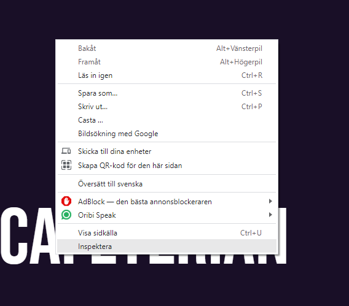
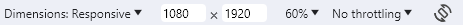

# Tips

## Using the correct resolution

This project is based on a 1080 x 1920 resolution 

To view the website on this resolution use the inspect tool by pressing right click on website

Then click on this icon to change to your desired resolution

Then change to the right resolution

## Developer controls
Controls used to change between slides

* To use the developer controls click the right or left side of the screen

* When the developer controls have been activated by clicking, arrow keys can also be used.

## data-interval

data-interval="10000" determines how many milliseconds have to pass before it changes to the next slide, 10000ms is 10 seconds

## id
 
id="productImage" is only used to position images.
The id for blurredDot.png and vibrantDot.png is recommended to be used for all slides as they position the purple bubbles with the price on.
Id:s that are used to position a product can be created and adjusted but make sure that the whole image is within the bubble.
Make sure that the product's id has "z-index: 1;" so that it is on the correct layer.

id="itemText" is used to position the text and to put the text on the top layer.
This should not be changed although depending on the length of the text a new id may be necessary.
Make sure that the price is always in the bubble.

