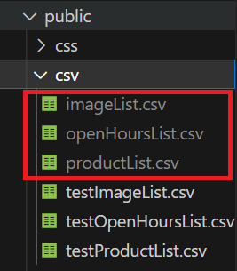

# Local setup

## Installs

* Install requirements

    ``` 
    python -m pip install -r requirements.txt
    ```

## Google sheet download

### Set up Google service account:
[Follow these instructions](serviceAccount.md)

### Get data from google sheet

* In the terminal from the projects root folder input the following: 

    ```
    python googleSheetDownloader.py
    ```

* Check the csv folder inside the public folder for these csv-files (see the image below)



## Finalise local setup

* In the terminal from the projects root folder input the following: 

    ```
    python .\startServer.py
    ```

* To view the project go to the local host at [127.0.0.1:8000](http://127.0.0.1:8000/)
* Alternate URL:

The following URL uses the same information as the one above. The parameters can be changed to use the desired data such as the test data. To achieve this change the paths that comes after the "`=`" symbol:

[127.0.0.1:8000/?products=productList.csv&images=imageList.csv&openHours=openHoursList.csv](http://127.0.0.1:8000/?products=productList.csv&images=imageList.csv&openHours=openHoursList.csv)

## Tips
[Configuration tips](configuration.md)
