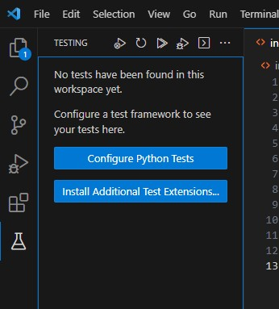
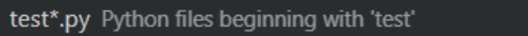

# Tests

## Before running tests
* Make sure that the [local setup](localSetup.md) has been followed
* Run [startServer.py](../startServer.py) and keep it running during testing

## How to run tests using Selenium
* In VS Code open the terminal
* Input "py -m pip install selenium"
* Input "py -m pip install requests"
* While having the test.py open in VS Code open the testing tab as illustrated in the image below:    

* If you are unable to find the testing tab go to "view" at the top of VS Code and press testing as shown below    

* When the testing tab is open, press the blue "Configure Python Tests" button
* Next choose "unittest" as displayed below:    

* Next choose "Root directory" as displayed below:    

* Lastly choose "test*.py" so that all files beginning their name with test will be run as demonstrated below:   
